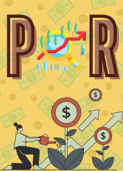
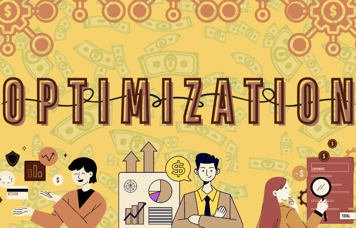

  
  
  

  

<h3 align="center">Get ready to become billionaire !!! 🤑💰💸💵
 </h3>

# Smart-Portfolio-Optimization

## Table of contents 👇🏻:
1. [Introduction](#Introduction)
2. [Data collection](#Data_collection)
3. [Data preprocessing](#Data_preprocessing)
4. [Interest rate calculation](#Interest_rate_calculation)
5. [Portfolio optimization method](#Portfolio_optimization_method)
6. [Show results after optimization](#Show_results_after_optimization)
4. [Second optimization and fine-tuning](#Second_optimization_and_fine-tuning).
7. [Members](#Members)
8. [References](#References)

 

## Introduction 🧐: 

Welcome to the high-octane world of finance, where Smart Portfolio Optimization isn't just a strategy; it's the superhero investors didn't know they needed. Imagine an investment approach fueled by algorithms, driven by data magic, and guided by the genius of artificial intelligence—a dynamic dance in the digital age.

This isn't your typical risk-and-return tango; it's a real-time symphony of adaptability, predicting market moves before they even happen. Join us as we unravel the secrets of Smart Portfolio Optimization—a financial innovation that's not just evolving but revolutionizing how we navigate the unpredictable waves of investments. Fasten your seatbelts; it's about to get exciting!
