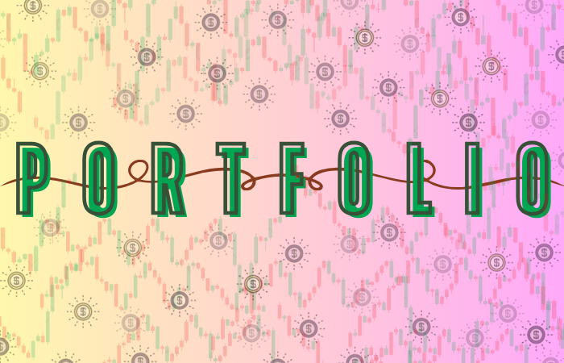
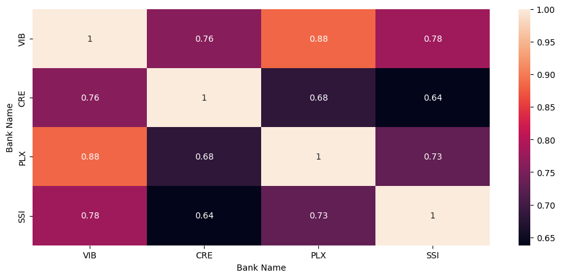
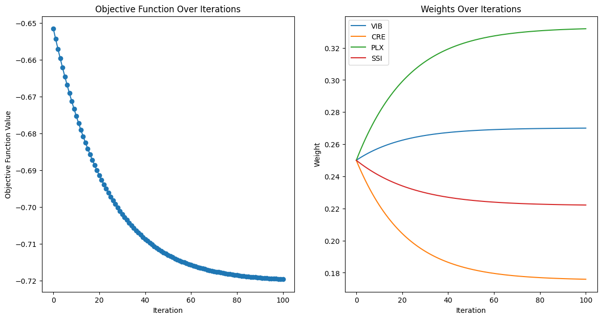
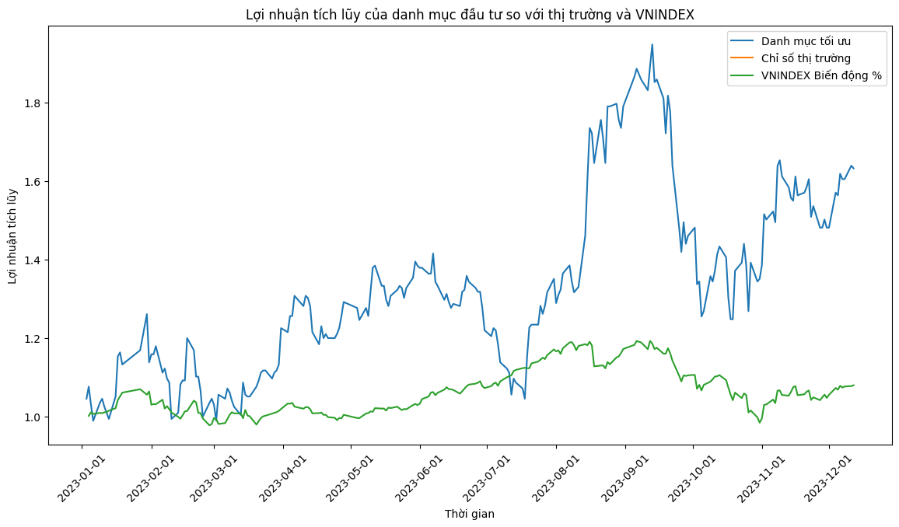
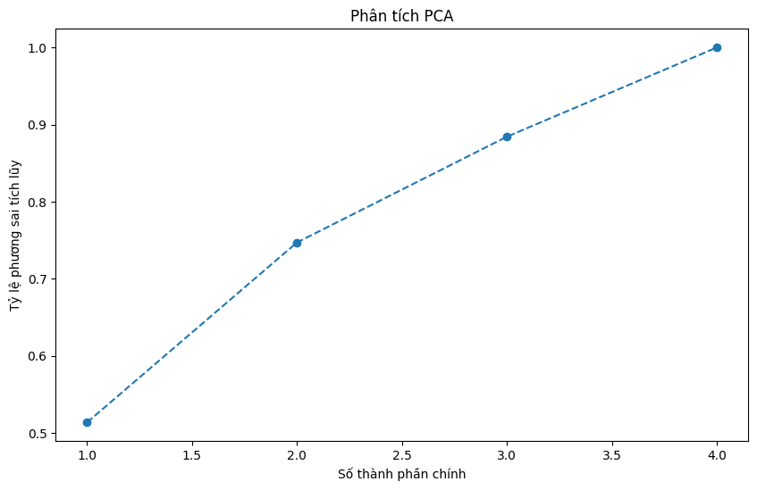

  

  <!-- Typing SVG by DenverCoder1 - https://github.com/DenverCoder1/readme-typing-svg -->
    
    

    

	 <b><i>"Get ready to become billionaires !!! 🤑💸"</i></b> 

# Smart-Portfolio-Optimization

## Table of contents 👇🏻:
1. [Introduction](#Introduction)
2. [Data Visualization](#Data-Visualization)
3. [Data Analysis](#Data-Analysis)
4. [Stochastic Gradient Descent](#Stochastic-Gradient-Descent)
5. [Members](#Members)
6. [References](#References)

 

# Introduction🔎: 
## *Overview 🐻:*
Welcome to the high-octane world of finance, where Smart Portfolio Optimization isn't just a strategy; it's the superhero investors didn't know they needed. Imagine an investment approach fueled by algorithms, driven by data magic, and guided by the genius of artificial intelligence—a dynamic dance in the digital age.

This isn't your typical risk-and-return tango; it's a real-time symphony of adaptability, predicting market moves before they even happen. Join us as we unravel the secrets of Smart Portfolio Optimization—a financial innovation that's not just evolving but revolutionizing how we navigate the unpredictable waves of investments. Fasten your seatbelts; it's about to get exciting!

## *The goal of our project🐃:*
- The goal of our project is to champion Smart Portfolio Optimization as a cutting-edge investment strategy. By harnessing algorithms, data analysis, and artificial intelligence, we aim to revoWe retrieve data directly from the VN30 platform. If the platform presents average data, we extract and utilize it as supporting evidence. This rigorous selection process establishes the foundation for well-informed decision-making by ensuring the reliability and comprehensiveness of our data sources.
  
### *Timeframe Specification :*
- Establish specific timeframes for data collection based on the strategic requirements of the Portfolio Optimization project.

## Data preprocessing 🐻:

###  *Handling Missing Values :*
- Implement methods to address and fill missing values in the dataset, ensuring completeness and avoiding data gaps that could impact analysis.

### *Outlier Detection and Removal :* 
- Apply statistical techniques, such as z-score analysis, to identify and remove outliers from the dataset, enhancing the robustness of subsequent analysis.

### *Organizing the Dataset :* 
- Structure the data in an organized format, facilitating easy access and utilization during the optimization phase.

## Data analysis 🔎:
### *Heatmap for Stock Analysis 📉:* 
 

 

 

#### Using Heatmap for Stock Analysis:
- Heatmaps are a valuable tool in stock analysis, providing a visual representation of data to quickly identify patterns and correlations between different stocks. The heatmap in the provided image uses a color-coded system to indicate the strength of the relationship between various stock shares, with darker colors typically representing stronger relationships or higher values.
#### Analysis of Stock Shares:
- The heatmap shows four different stocks, labeled VIB, PLX, CRE, and SSI. Each stock is compared with itself and the others, resulting in a matrix where the diagonal represents a perfect correlation of 1, as a stock will always have a perfect correlation with itself. Here's a detail analysis based on the heatmap:
  
- *VIB and CRE*: With a correlation of 0.78, these two stocks have a strong positive correlation, suggesting that their prices tend to move in the same direction. Investors holding one of these stocks might consider the other as a similar risk profile investment.

- *VIB and SSI*: This pair shows the strongest positive correlation of 0.86, indicating a very strong tendency to move together. This could imply that they are influenced by similar factors or are in related sectors.

- *PLX and CRE*: They have a moderate positive correlation of 0.47, which is less strong than VIB and CRE, but still significant enough to suggest some level of similar price movement.

- *PLX and SSI*: The correlation is 0.38, which is relatively weak. This suggests that PLX and SSI stock prices do not move in tandem as closely as some of the other pairs.

- *CRE and SSI*: They have a high positive correlation of 0.8, indicating a strong likelihood that they move in the same direction.

#### Comparison of Stock Shares
- The off-diagonal elements of the heatmap show the correlation between different stocks. For instance, VIB and CRE have a correlation of 0.78, indicating a strong positive relationship. Similarly, SSI shows a strong positive correlation with VIB at 0.86. On the other hand, PLX shows relatively weaker correlations with the other stocks, such as a 0.37 with VIB and a 0.38 with SSI.
  
#### Correlation Analysis
- The correlations range from 0.37 to 0.86, suggesting varying degrees of relationships between the stock pairs. Strong correlations (closer to 1) suggest that the stocks move in the same direction, while weaker correlations (closer to 0) indicate less of a relationship. It's important to note that correlation does not imply causation, and these values simply reflect the historical movement of the stocks relative to each other.

#### Conclusion on Investment

- From an investment perspective, if an investor is looking to diversify their portfolio to minimize risk, they might look for stocks that have low or negative correlations with each other. In this case, PLX might be a candidate for diversification as it has the lowest correlations with the other stocks.

- However, if an investor is looking to reinforce their position in a particular market trend, they might choose stocks with high correlations, like VIB and SSI or CRE and SSI, to potentially maximize gains from movements in that trend.

- It's important to note that correlation does not imply causation, and these figures should be one of many factors considered when making investment decisions. Other fundamental and technical analysis should also be conducted to understand the full picture of each stock's potential.

### *Pair Plot for Stock Analysis 📊:* 
 

 

####  Using Pair Plot for Stock Analysis:
- Pair plots are useful in stock market analysis because they allow investors to quickly identify relationships between different stocks and to spot trends or anomalies in the data. They can also help in assessing the risk and return profile of a portfolio by visualizing how different stocks interact with each other. 
#### Analysis of Stock Shares:
- The pair plot shows four different types of stock shares, which are represented by the variables VBJ, PLX, CRE, and SSI. The diagonal histograms represent the distribution of each stock's values, while the off-diagonal scatterplots show the relationship between pairs of stocks.
#### Comparison of Stock Shares:
- *VBJ Stock*: The histogram for VBJ shows a distribution that is approximately normal, suggesting that the stock's performance metrics are centered around a mean value with symmetrical variability on both sides.
- *PLX Stock*: PLX's histogram also appears to be normally distributed, with a peak slightly skewed towards the left, indicating a mean value with a slight bias towards lower values.
- *CRE Stock*: The distribution of CRE is similar to PLX, with a slight left skewness, suggesting a concentration of lower values.
- *SSI Stock*: SSI's histogram shows a distribution that is less symmetrical than the others, with a potential right skewness, indicating a possibility of higher outlier values.
#### Correlation Analysis:
- The scatterplots indicate how each pair of stocks might move in relation to each other. For instance, if the points in a scatterplot between VBJ and PLX form a clear line with a positive slope, it would suggest a positive correlation, meaning that as VBJ stock values increase, PLX stock values also tend to increase.
#### Conclusion on Investment:

- Based on the pair plot alone, it is not possible to conclusively determine which stock is the best investment without additional context such as the time frame of the data, the specific financial metrics being analyzed, and the investment goals of the individual. However, investors might look for stocks with stable distributions (less skewness) and positive correlations with other stocks if they are seeking diversified portfolios that can potentially reduce risk.

### *Comparative Analysis of Closing Prices for VIB, PLX, and CRE Stocks 📊:* 
 

 

#### Introduction:
- This report presents a visual analysis of the closing prices of three distinct stocks: VIB, PLX, and CRE. The data is processed and visualized using Python with the Pandas and Cufflinks libraries, which are instrumental in handling and plotting financial time series data.

#### Data Processing:
- The dataset was manipulated to convert the 'time' column into a datetime format, ensuring the proper chronological order of the time series. This was achieved by utilizing Pandas' to_datetime method and subsequently setting this column as the DataFrame's index. This preparatory step is essential for accurate time series analysis. It was also necessary to extract the closing prices from a multi-level columnar structure, which were then assigned to individual stock identifiers.

#### Visualization:
- The resulting chart, titled Closing Prices of Three Types, displays the historical closing prices of the stocks VIB, PLX, and CRE. The horizontal axis represents time, labeled as Year, and the vertical axis denotes the closing price, labeled as Price. Each stock is represented by a distinct color for easy distinction and comparative analysis.

#### Observations:
- *VIB Stock*: Exhibits higher closing prices relative to PLX and CRE, with significant volatility noted. A general downtrend is observable commencing around mid-2021.
- *PLX Stock*: Demonstrates a gradual and more consistent increase in closing price over the observed period.
- *CRE Stock*: Shows varied fluctuations with a modest overall uptrend in its closing price.
#### Conclusion:
- The chart effectively encapsulates the performance trends of the three stocks over the observed period. VIB's performance shows higher volatility and a notable decrease in value, suggesting a period of instability or market corrections. In contrast, PLX's steady growth could be indicative of consistent performance and potentially stable market conditions. CRE's fluctuating nature, while showing an upward trend, may signal a more complex market behavior that warrants further analysis to understand underlying factors.

# Stochastic Gradient Descent 🥇

*SGD stands for "Stochastic Gradient Descent," an optimization algorithm commonly used in machine learning and machine learning to find the optimal value of a loss function. SGD is an important part of many machine learning and neural network algorithms, especially when you train deep models.*

## ***Portfolio Optimization Using Expected Gradient Descent***
 

 

 

 

### Objective Function

**Maximize:** $f$ (**W**)

in there:
- \( f(\mathbf{w}) \) is the objective function, usually the expected return of the portfolio, depending on the weight vector \( \mathbf{w} \).

### Constraint

1. **Summation Constraint:** \( \sum_{i=1}^{n} w_i = 1 \)

    This ensures that the total weight of all assets in the portfolio is 1 (i.e. 100%).

2. **Non-Negative Constraint:** \( w_i \geq 0 \) for all \( i \)

    This ensures that there are no negative weights, i.e. no short positions.

3. **Optional: Other Constraints**

    Other constraints may include upper and lower limits on the weighting of each asset, or constraints on the maximum acceptable level of risk.

### Lagrangian function

In case of using Lagrange method to solve:

**L(\mathbf{w}, \lambda) =** \( f(\mathbf{w}) - \lambda \left( \sum_{i=1}^{n} w_i - 1 \right) \ )

in there:
- \( \lambda \) is a Lagrange multiplier, related to the weighted sum constraint.

In the portfolio optimization problem, the goal is usually to maximize the expected return \( f(\mathbf{w}) \).

### Calculate Your Portfolio's Expected Return (`expected_return`)

Expected return is calculated by multiplying each stock's weights (`optimal_weights`) by the average daily return (`returns.mean(axis=0)`) and summing.

**Recipe:**
`expected_return = optimal_weights * mean(returns)`

### Calculating Portfolio Risk (`portfolio_risk`)

The risk of the portfolio is calculated using the covariance matrix (`covariance_matrix`) and the weights of the stocks.

**Recipe:**
`portfolio_risk = sqrt(optimal_weights^T * (covariance_matrix * optimal_weights))`

### Sharpe Ratio Rating (`sharpe_ratio`)

Sharpe Ratio measures a portfolio's performance relative to the risk-free rate (`risk_free_rate`), normalized for risk.

**Recipe:**
`sharpe_ratio = (expected_return - risk_free_rate) / portfolio_risk`

### Annualization

- Expected return and Sharpe Ratio are annualized (converted to an annual value) by multiplying by 252, the average number of trading days in a year.
- Risk is annualized by multiplying by the square root of 252.

## ***Cumulative return of the portfolio relative to the market***
 

 

*During the period from '2023-01-01' to '2023-12-12,' both the optimal portfolio and VNINDEX exhibit a trend of co-varying fluctuations. The portfolio demonstrates a minor impact from VNINDEX, contributing to its overall growth. It is noticeable that towards the end of the year, the optimal portfolio experiences an increasing trend in weight allocation, leading to higher returns. This observation suggests a potential correlation between the portfolio's performance and the VNINDEX, with the portfolio showing a responsive growth pattern influenced by the market index.*

 

 

## Principal Component Analysis (PCA)

 

 

- The first principal component explains about 30% of the total variation.

- As principal components are added, the proportion of cumulative variance increases, indicating that each additional principal component helps explain a portion of the remaining total variation.

- By the time the fourth component is reached, almost 100% of the total variation has been explained, which means that the four main components have explained most of the variation in your data.

#### ***The implications of this in the context of portfolio management could be:***

- **Diversification:** If just one or two major components explain the majority of the variation, it may indicate that the portfolio is not diversified well enough, as a small number of stocks have a large influence on the variation. category bias.

- **Concentration Risk:** If a small number of components explain the majority of variation, there may be concentration risk in a few stocks or industries.

- **Consider Adjusting Your Portfolio:*** You can consider adjusting the weights of stocks in your portfolio based on information from PCA to minimize risk and optimize returns.

## Apply new Weights to check Historical Performance
 

 

# Members 👨🏻‍💻👩🏻‍💻👨🏻‍💻:

| Index |         Name          |     ID      |                  Email                  |                       Github                                |                              Contribution                              |
| :---: | :-------------------: | :---------: |:---------------------------------------:| :---------------------------------------------------------: | :----------------------------------------------------------------: |
|   1   |     Pham Le Duc Thinh | ITDSIU20085 |           pldthinh.ityu@gmail.com       |           [ducthinh17](https://github.com/ducthinh17)       |          33.333%                                                    |
|   2   |     Ung Thi Hoai Thuong  | ITDSIU20028 |          ungthihoaithuong.tk1@gmail.com          |      [Hthuong92](https://github.com/Hthuong92)      |         33.333%                                                     |
|   3   |  Nguyen Thanh Binh     | ITDSIU20056 |      ntbinh.ityu@gmail.com               |   [OliverRed1602](https://github.com/OliverRed1602)         |         33.333%                                                  

 

