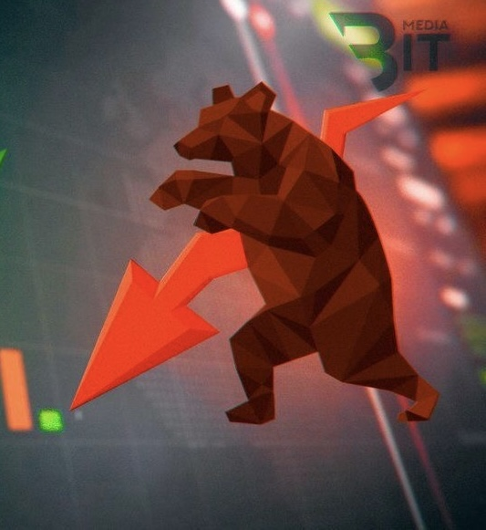

  
  
  

  

	 <b><i>"Get ready to become billionaire !!! 🤑💰💸💵"</i></b> 

# Smart-Portfolio-Optimization

## Table of contents 👇🏻:
1. [Introduction](#Introduction)
2. [Data analysis](#Data_analysis)
3. [Models](#Models)
4. [Members](#Members)
5. [References](#References)

 

# Introduction🔎: 
## *Overview 🐻:*
Welcome to the high-octane world of finance, where Smart Portfolio Optimization isn't just a strategy; it's the superhero investors didn't know they needed. Imagine an investment approach fueled by algorithms, driven by data magic, and guided by the genius of artificial intelligence—a dynamic dance in the digital age.

This isn't your typical risk-and-return tango; it's a real-time symphony of adaptability, predicting market moves before they even happen. Join us as we unravel the secrets of Smart Portfolio Optimization—a financial innovation that's not just evolving but revolutionizing how we navigate the unpredictable waves of investments. Fasten your seatbelts; it's about to get exciting!

## *The goal of our project🐃:*
- The goal of our project is to champion Smart Portfolio Optimization as a cutting-edge investment strategy. By harnessing algorithms, data analysis, and artificial intelligence, we aim to revolutionize how investors navigate the volatile financial landscape. This approach promises real-time adaptability and the ability to predict market moves, presenting a dynamic alternative to traditional risk-and-return models !

# Data Analysis 📈📉📊:

## Data Collection 🐃:
### *Identification of Essential Metrics :*
- Our journey begins by delineating the essential metrics crucial for Portfolio Optimization. These encompass key variables such as stock prices, trading volumes, and relevant financial indicators derived from the comprehensive Analysis Stock VN30.

### *Selection of Data Sources :*
- Drawing from Analysis Stock VN30, we ensure our data sources are reputable, providing a comprehensive view of market dynamics. This meticulous selection process sets the stage for informed decision-making.

### *Timeframe Specification :*
- Establish specific timeframes for data collection based on the strategic requirements of the Portfolio Optimization project.

## Data preprocessing 🐻:

###  *Handling Missing Values :*
- Implement methods to address and fill missing values in the dataset, ensuring completeness and avoiding data gaps that could impact analysis.

### *Outlier Detection and Removal :* 
- Apply statistical techniques, such as z-score analysis, to identify and remove outliers from the dataset, enhancing the robustness of subsequent analysis.

### *Organizing the Dataset :* 
- Structure the data in an organized format, facilitating easy access and utilization during the optimization phase.

  
# Members 👨🏻‍💻👨🏻‍💻👩🏻‍💻:

| Index |         Name          |     ID      |                  Email                  |                       Github                                |                              Position                              |
| :---: | :-------------------: | :---------: |:---------------------------------------:| :---------------------------------------------------------: | :----------------------------------------------------------------: |
|   1   |     Pham Le Duc Thinh | ITDSIU20085 |           pldthinh.ityu@gmail.com       |           [ducthinh17](https://github.com/ducthinh17)       |          Leader                                                    |
|   2   |    Nguyen Thanh Binh  | ITDSIU20056 |          ntbinh.ityu@gmail.com          | [OliverRed1602](https://github.com/OliverRed1602)           |         Member                                                     |
|   3   |   Ung Thi Hoai Thuong    | ITDSIU20028 |      ungthihoaithuong.tk1@gmail.com               |       [Hthuong92](https://github.com/Hthuong92)     |         Member                                                   
