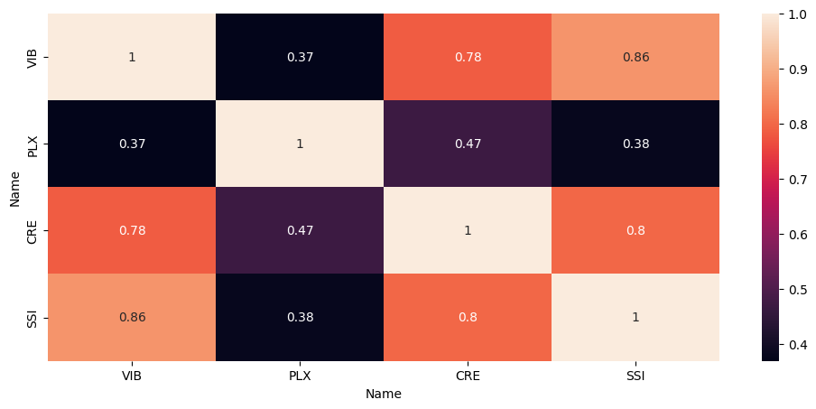
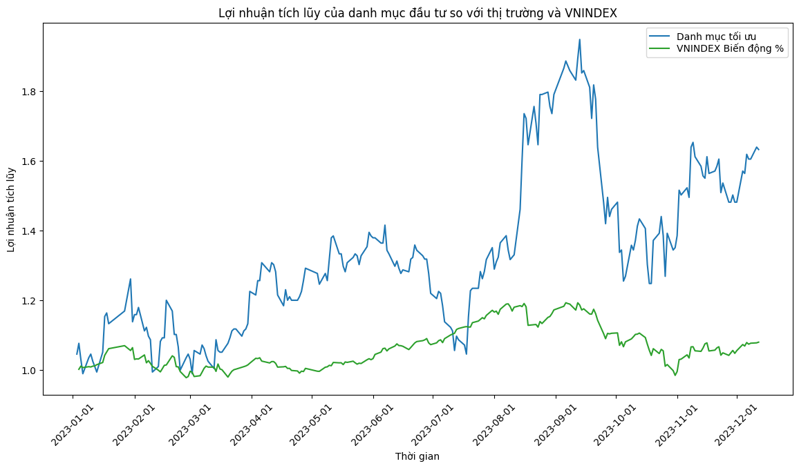

  

  <!-- Typing SVG by DenverCoder1 - https://github.com/DenverCoder1/readme-typing-svg -->
    
    

    

	 <b><i>"Get ready to become billionaires !!! 🤑💸"</i></b> 

# Smart-Portfolio-Optimization

## Table of contents 👇🏻:
1. [Introduction](#Introduction)
2. [Data Visualization](#Data_Visualization)
3. [Data Analysis](#Data_Analysis)
4. [Stochastic Gradient Descent](#Stochastic_Gradient_Descent)
5. [Members](#Members)
6. [References](#References)

 

# Introduction🔎: 
## *Overview 🐻:*
Welcome to the high-octane world of finance, where Smart Portfolio Optimization isn't just a strategy; it's the superhero investors didn't know they needed. Imagine an investment approach fueled by algorithms, driven by data magic, and guided by the genius of artificial intelligence—a dynamic dance in the digital age.

This isn't your typical risk-and-return tango; it's a real-time symphony of adaptability, predicting market moves before they even happen. Join us as we unravel the secrets of Smart Portfolio Optimization—a financial innovation that's not just evolving but revolutionizing how we navigate the unpredictable waves of investments. Fasten your seatbelts; it's about to get exciting!

## *The goal of our project🐃:*
- The goal of our project is to champion Smart Portfolio Optimization as a cutting-edge investment strategy. By harnessing algorithms, data analysis, and artificial intelligence, we aim to revolutionize how investors navigate the volatile financial landscape. This approach promises real-time adaptability and the ability to predict market moves, presenting a dynamic alternative to traditional risk-and-return models !

# Data Visualization 🎭:

## Fluctuations in 4 years
 

 

## Moving Average chart (SMA)
 

 

## Composite Enhancement Chart
 

 

# Data Analysis 📈📉📊:

## Data Collection 🐃:
### *Identification of Essential Metrics :*
- Our journey begins by delineating the essential metrics crucial for Portfolio Optimization. These encompass key variables such as stock prices, trading volumes, and relevant financial indicators derived from the comprehensive Analysis Stock VN30.

### *Selection of Data Sources :*
- Drawing from Analysis Stock VN30, we ensure our data sources are reputable, providing a comprehensive view of market dynamics. This meticulous selection process sets the stage for informed decision-making.

### *Timeframe Specification :*
- Establish specific timeframes for data collection based on the strategic requirements of the Portfolio Optimization project.

## Data preprocessing 🐻:

###  *Handling Missing Values :*
- Implement methods to address and fill missing values in the dataset, ensuring completeness and avoiding data gaps that could impact analysis.

### *Outlier Detection and Removal :* 
- Apply statistical techniques, such as z-score analysis, to identify and remove outliers from the dataset, enhancing the robustness of subsequent analysis.

### *Organizing the Dataset :* 
- Structure the data in an organized format, facilitating easy access and utilization during the optimization phase.

## Data analysis 🐃:
### *Visualizing statistical data :*
 

 

#### Correlation Coefficient: 
- *VIB and CRE:* There is a high positive correlation of 0.78 between VIB and CRE, indicating that when the price of VIB stock goes up, the price of CRE tends to also go up, and vice versa.
- *VIB and PLX:* The correlation between VIB and PLX is 0.37, which is a moderate positive correlation. This suggests that there is some relationship between the movements of these two stocks, but it is not as strong as the VIB and CRE correlation.
- *PLX and CRE:*  PLX and CRE have a correlation of 0.47. This is also a moderate positive correlation, indicating that these stocks also tend to move somewhat in tandem, but the relationship is not particularly strong.
- *=> Interpretation:* The correlation values suggest that VIB and CRE stocks are more closely related to each other than to PLX. This could be due to a variety of factors such as the sectors they operate in, their market capitalizations, or their sensitivity to similar economic factors.
#### Investment Strategy: 
- Investors might use this information to diversify their portfolio or to identify pairs of stocks to consider for pair trading strategies. For instance, if an investor wants to minimize risk through diversification, they might choose to invest in stocks that are not strongly correlated.
#### Limitations:  
- It's important to note that correlation does not imply causation. Just because two stocks have a high correlation does not mean that the movement of one is causing the movement of the other. Additionally, the correlation can change over time due to changing market conditions.
#### Further Analysis:
- To make investment decisions, one should also consider other factors such as the individual performance of the stocks, the overall market trend, and the specific sectors these stocks belong to. Additionally, looking at the historical volatility and other financial metrics could provide a more comprehensive view of the investment landscape.
#### Summary: 
- In summary, the heatmap provides a visual representation of how closely the stock prices of VIB, PLX, and CRE have moved together in the past. This can be a useful tool for investors to understand relationships between stocks, but it should be part of a broader analysis that includes a variety of other financial and economic indicators

### *Exploratory data analysis:* 
 

 

#### Distributions:
- The histograms on the diagonal show the distribution of the VIB, PLX, and CRE values. These plots allow us to see if the data is normally distributed, skewed, or if there are any outliers. From the histograms, it appears that the distributions have a central peak and taper off towards the sides, suggesting a rough approximation of a normal distribution.
#### Correlations:
- The scatterplots show how each pair of stocks relates to each other.
- For instance, the scatterplot for VIB vs. PLX shows each day's closing value for VIB on the x-axis and PLX on the y-axis.
- If the points form a line going from the bottom left to the top right, it suggests a positive correlation, meaning as one goes up, so does the other. Conversely, a line from the top left to the bottom right would suggest a negative correlation.
#### Volatility Analysis: 
- By looking at the spread of the scatterplots, we can get a sense of the volatility of the stocks. A wider spread means more volatility, while a narrower spread means less.
- From the scatterplots, we can compare the volatility and behavior of the stocks with each other.For example, if the scatterplot for VIB vs. PLX is more spread out than VIB vs. CRE, it could mean that VIB and PLX share a more volatile relationship.
- Outliers: Scatterplots can also help identify outliers – points that fall far away from the others. These might represent days with unusual market activity.
#### Interpretation:
- The exact relationship between the stocks would require a closer examination of the scatterplots. However, if the scatterplots show a clear pattern or trend, it could be indicative of a strong relationship between the stock pairings.

# Stochastic Gradient Descent 🥇

*SGD stands for "Stochastic Gradient Descent," an optimization algorithm commonly used in machine learning and machine learning to find the optimal value of a loss function. SGD is an important part of many machine learning and neural network algorithms, especially when you train deep models.*

## ***Portfolio Optimization Using Expected Gradient Descent***
 

 

## ***Cumulative return of the portfolio relative to the market***
 

 

## Apply new Weights to check Historical Performance
 

# Members 👨🏻‍💻👨🏻‍💻👩🏻‍💻:

| Index |         Name          |     ID      |                  Email                  |                       Github                                |                              Contribution                              |
| :---: | :-------------------: | :---------: |:---------------------------------------:| :---------------------------------------------------------: | :----------------------------------------------------------------: |
|   1   |     Pham Le Duc Thinh | ITDSIU20085 |           pldthinh.ityu@gmail.com       |           [ducthinh17](https://github.com/ducthinh17)       |          33.333%                                                    |
|   2   |    Nguyen Thanh Binh  | ITDSIU20056 |          ntbinh.ityu@gmail.com          | [OliverRed1602](https://github.com/OliverRed1602)           |         33.333%                                                     |
|   3   |   Ung Thi Hoai Thuong    | ITDSIU20028 |      ungthihoaithuong.tk1@gmail.com               |       [Hthuong92](https://github.com/Hthuong92)     |         33.333%                                                  

 

